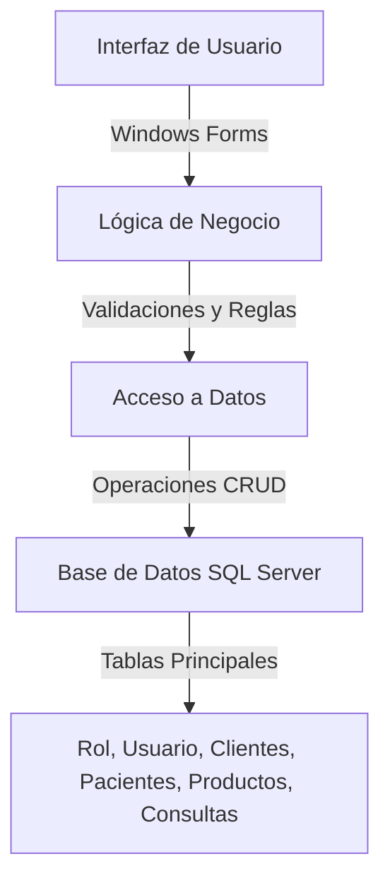
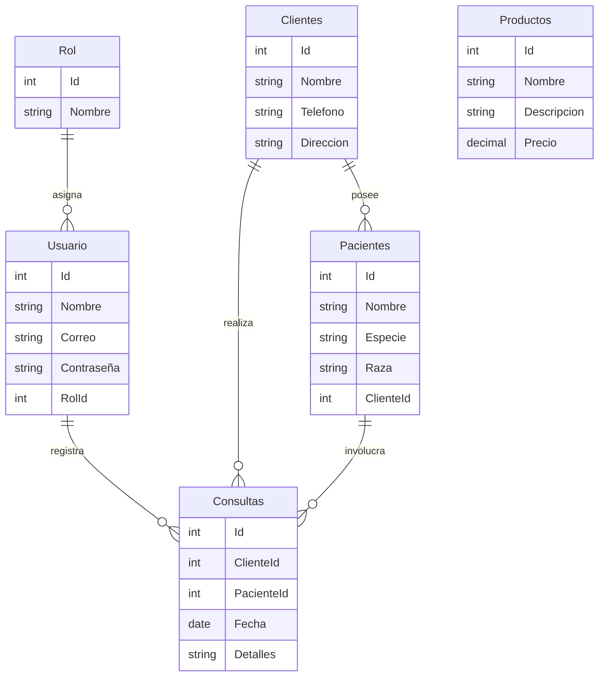

# Gestión Veterinaria

Este proyecto es un sistema de gestión para una clínica veterinaria, desarrollado en C# utilizando Windows Forms y SQL Server como base de datos. Su objetivo principal es facilitar la administración de las operaciones diarias de la clínica, como la gestión de usuarios, clientes, pacientes, productos y consultas.

## Funcionalidades Principales

1. **Gestión de Usuarios y Roles**:
   - Registro, edición y eliminación de usuarios.
   - Asignación de roles a los usuarios (Administrador, Supervisor, Agente de Servicio).
   - Control de acceso basado en roles.

2. **Gestión de Clientes y Pacientes**:
   - Registro y mantenimiento de clientes (propietarios de mascotas).
   - Registro y mantenimiento de pacientes (mascotas).

3. **Control de Consultas**:
   - Registro de consultas realizadas en la clínica, incluyendo información del cliente, mascota, fecha y hora.

4. **Gestión de Productos**:
   - Registro y consulta de productos disponibles en la clínica, como medicamentos y suministros.

5. **Reportes**:
   - Generación de listados de clientes, pacientes y productos.

6. **Autenticación y Seguridad**:
   - Inicio de sesión con validación de credenciales.
   - Control de intentos fallidos de inicio de sesión.

7. **Configuración y Personalización**:
   - Configuración de datos del usuario logueado.
   - Ventana de ayuda y sección "Acerca del Sistema".

## Estructura del Proyecto

El proyecto sigue una arquitectura en capas para separar las responsabilidades:

- **Capa de Presentación**: Interfaz gráfica desarrollada con Windows Forms.
- **Capa de Dominio**: Lógica de negocio y validaciones.
- **Capa de Acceso a Datos**: Conexión y operaciones con la base de datos SQL Server.
- **Capa de Soporte**: Clases auxiliares y caché de datos.

## Base de Datos

La base de datos `GestionVeterinaria` incluye las siguientes tablas principales:

- **Rol**: Define los roles de usuario.
- **Usuario**: Almacena la información de los usuarios del sistema.
- **Clientes**: Información de los propietarios de mascotas.
- **Pacientes**: Información de las mascotas.
- **Productos**: Detalles de los productos disponibles.
- **Consultas**: Registro de consultas realizadas.

## Requisitos

- **Entorno de Desarrollo**: Visual Studio con .NET Framework 4.7.2.
- **Base de Datos**: SQL Server.

## Instalación

1. Restaurar la base de datos utilizando el archivo `GestionVeterinaria.sql`.
2. Abrir el proyecto en Visual Studio y compilar la solución.
3. Ejecutar la aplicación desde el proyecto principal.

## Diagrama del Proyecto

Este diagrama muestra la arquitectura en capas del proyecto, destacando la interacción entre la interfaz de usuario, la lógica de negocio, el acceso a datos y la base de datos.

