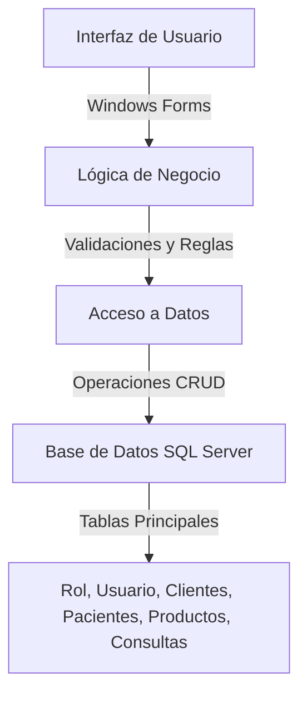
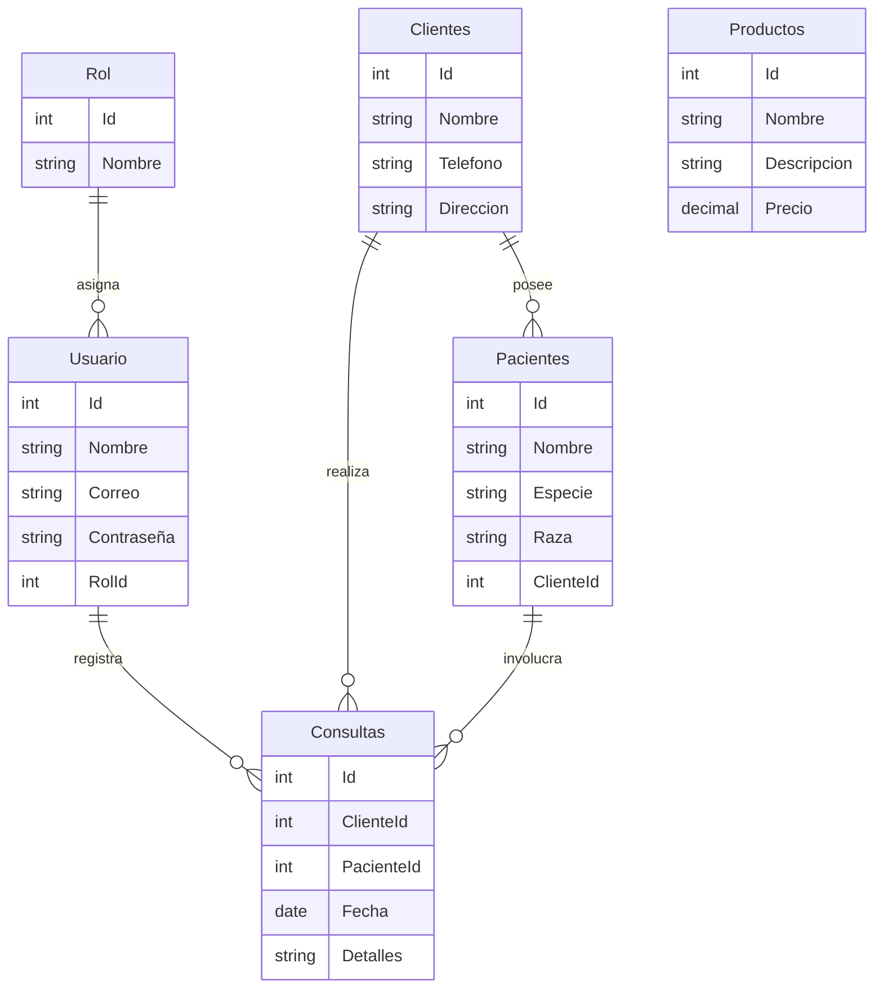

# Gestión Veterinaria

Este proyecto es un sistema de gestión para una clínica veterinaria, desarrollado en C# utilizando Windows Forms y SQL Server como base de datos. 

## Funcionalidades Principales

1. **Gestión de Usuarios y Roles**:
2. **Gestión de Clientes y Pacientes**:
3. **Control de Consultas**:
4. **Gestión de Productos**:
5. **Reportes**:

## Estructura del Proyecto

El proyecto sigue una arquitectura en capas para separar las responsabilidades:  

- **Capa de Presentación**: Interfaz gráfica desarrollada con Windows Forms.
- **Capa de Dominio**: Lógica de negocio y validaciones.
- **Capa de Acceso a Datos**: Conexión y operaciones con la base de datos SQL Server.
- **Capa de Soporte**: Clases auxiliares y caché de datos.

#### Diagrama del Proyecto

## Base de Datos

La base de datos `GestionVeterinaria` incluye las siguientes tablas principales:

- **Rol**: Define los roles de usuario.
- **Usuario**: Almacena la información de los usuarios del sistema.
- **Clientes**: Información de los propietarios de mascotas.
- **Pacientes**: Información de las mascotas.
- **Productos**: Detalles de los productos disponibles.
- **Consultas**: Registro de consultas realizadas.

#### Diagrama entidad relación

## Requisitos

- **Entorno de Desarrollo**: Visual Studio con .NET Framework 4.7.2.
- **Base de Datos**: SQL Server.

## Instalación

1. Restaurar la base de datos utilizando el archivo `GestionVeterinaria.sql`.
2. Abrir el proyecto en Visual Studio y compilar la solución.
3. Ejecutar la aplicación desde el proyecto principal.
